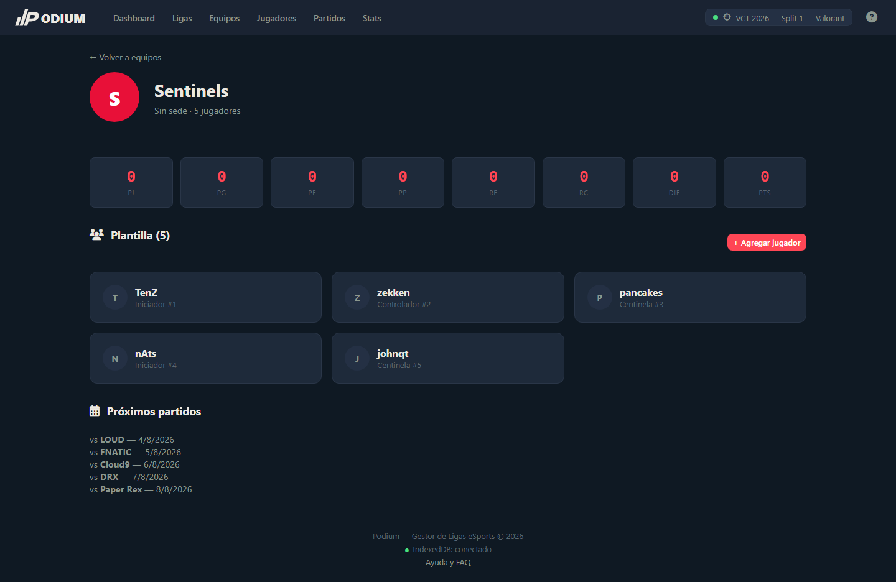
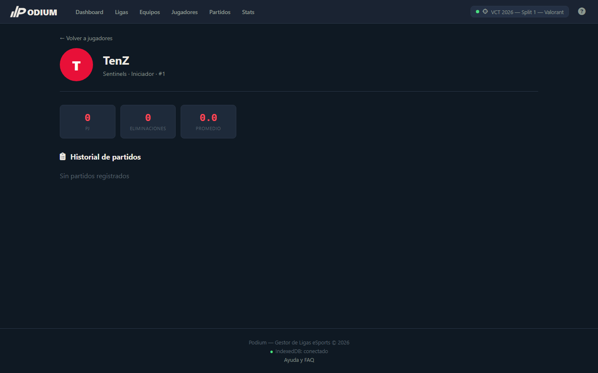
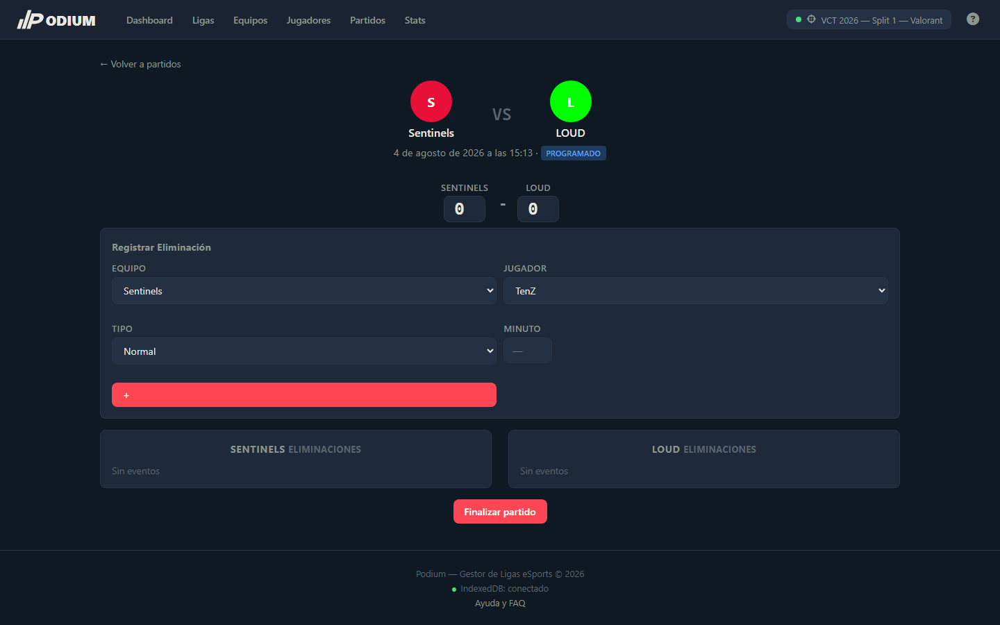
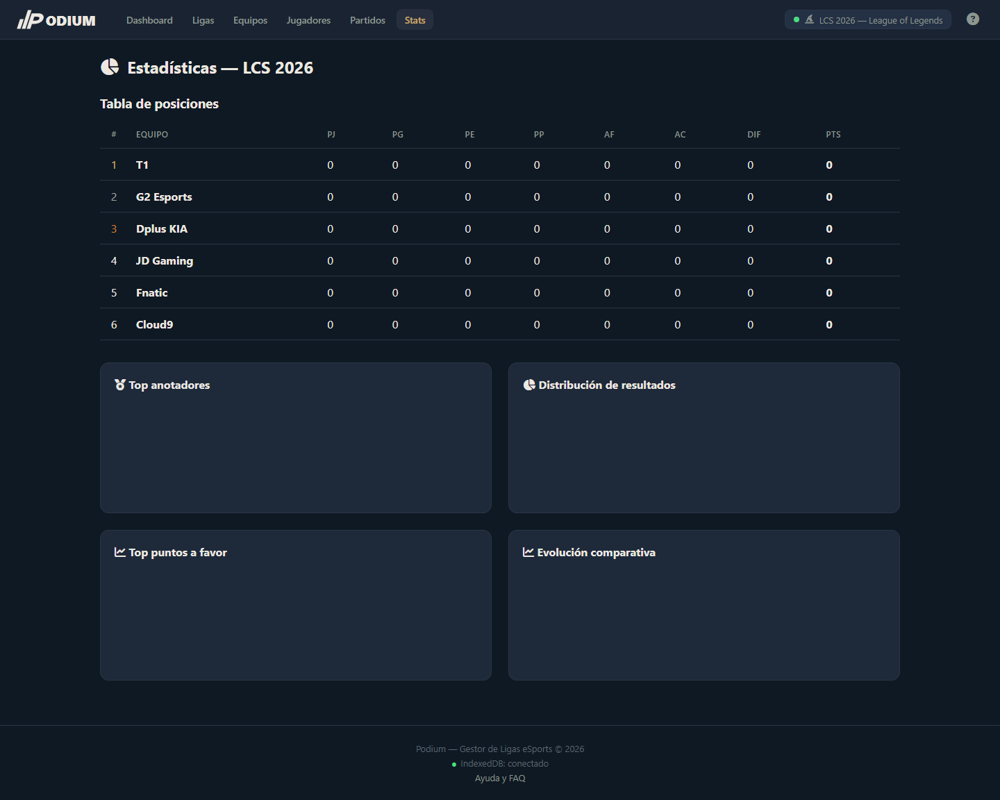

# Podium — Gestor de Ligas eSports

SPA en **JavaScript vanilla** para gestionar ligas y torneos de eSports. Sin backend, sin registro, **100 % offline** con persistencia en IndexedDB. Implementa las 9 vistas, el sistema multi-deporte con mapa de terminología y las dos modalidades de torneo exigidas (liga y eliminación directa, incluyendo doble eliminación).

---

## 1. Deportes soportados

La aplicación soporta **3 deportes** con identidad visual y terminología propias. La adaptación es **cosmética**: cambian etiquetas y colores, pero la lógica interna (puntuación 3/1/0, estructura de datos) es idéntica.

### Mapa de terminología (`js/data/sports.js`)

| Concepto | Valorant | Fighting Games | League of Legends |
| --- | --- | --- | --- |
| Evento de anotación | Eliminación | KO | Asesinato |
| Plural del evento | Eliminaciones | KOs | Asesinatos |
| Ranking de anotadores | Top Fragger | Finalizador | MVP |
| Etiqueta del marcador | Rondas | Rondas | Asesinatos |
| Abreviatura GF / GC | RF / RC | RF / RC | AF / AC |
| Tipos de evento | Normal, Headshot, Ability, Ultimate | KO | Normal, Habilidad, Ultimate |
| Equipo | Escuadra | Luchador | Equipo |
| Jugador | Agente | Peleador | Campeón |
| Victoria | Victoria | KO Técnico | Victoria |
| Ronda / Jornada | Ronda | Round | Jornada |
| Cancha / Mapa | Mapa | Escenario | Grieta |
| Ranking | Ranking de Top Fraggers | Ranking de Finalizadores | Ranking de MVPs |

### Identidad visual por deporte

| Deporte | Tema CSS | Color acento |
| --- | --- | --- |
| Valorant | `css/themes/valorant.css` | `#ff4655` (rojo) |
| Fighting Games | `css/themes/fighting.css` | `#fbbf24` (dorado) |
| League of Legends | `css/themes/lol.css` | champagne `#c8aa6e` |

Además existe la opción **"Formato personalizado"**: al crear una liga puedes definir nombre, ícono, color, estructura de marcador (simple, mejor de N sets o automático por eventos), puntos por victoria/empate/derrota y toda la terminología (evento, marcador, equipo, jugador, posiciones, etc.).

---

## 2. Funcionalidades

- **CRUD completo**: ligas, equipos, jugadores, partidos y eventos
- **Dos modalidades**:
  - *Liga* — todos contra todos, con vuelta simple o ida y vuelta y **fixture generado automáticamente**
  - *Eliminación directa* — **bracket simple o doble** (con losers bracket) para 4, 8 o 16 equipos; el ganador avanza automáticamente a la siguiente ronda
- **Tabla de posiciones** con puntuación (3 pts victoria, 1 empate, 0 derrota; desempate por diferencia y luego puntos a favor)
- **Operaciones transaccionales**: finalizar partido (actualiza partido, equipos, jugadores y avanza el bracket en una sola transacción) y deshacer partido (con restricción en brackets si la siguiente ronda ya se finalizó)
- **Gráficos estadísticos** con Chart.js (más de 6 gráficos, 4 tipos: doughnut, barras, líneas y radar)
- **Registro de eventos** por partido con jugador, tipo y minuto opcional; eventos eliminables individualmente
- **Importar/exportar** ligas completas en JSON (validación de estructura y duplicados)
- **Filtros**: búsqueda con debounce, por equipo, por posición, por estado, por ronda y por rango de fechas
- **PWA-ready** con manifest, service worker e instalable offline
- **100 % offline** — no requiere servidor ni conexión a internet

---

## 3. Las nueve vistas

| ID | Vista | Ruta |
|---|---|---|
| V-01 | Dashboard | `#dashboard` |
| V-02 | Ligas | `#leagues` |
| V-03 | Equipos | `#teams` |
| V-04 | Detalle de Equipo | `#team/:id` |
| V-05 | Jugadores | `#players` |
| V-06 | Detalle de Jugador | `#player/:id` |
| V-07 | Partidos | `#matches` |
| V-08 | Detalle de Partido | `#match/:id` |
| V-09 | Estadísticas | `#stats` |

## 4. Esquema de IndexedDB (`js/db/schema.js`)

Base de datos `podium-db`, versión 2, con 5 object stores:

| Store | keyPath | Índices |
|---|---|---|
| `leagues` | `id` | `byName` (único), `byActive` |
| `teams` | `id` | `byLeague`, `byName` |
| `players` | `id` | `byTeam`, `byName` |
| `matches` | `id` | `byLeague`, `byHomeTeam`, `byAwayTeam`, `byDate`, `byStatus`, `byRound` |
| `events` | `id` | `byMatch`, `byPlayer` |

### Relaciones
- `league` 1—N `team` → 1—N `player`
- `league` 1—N `match`
- `match` 1—N `event` (evento ligado a un jugador)
- En eliminación directa, cada `match` referencia al siguiente (`nextMatchId` + `nextSlot`) y, en doble eliminación, al partido del losers bracket (`loserMatchId` + `loserSlot`)

### Acceso
Todas las operaciones pasan por la capa helper de `js/db/db.js` (`getAll`, `getById`, `getByIndex`, `addItem`, `putItem`, `deleteItem`). Ningún componente abre transacciones ad-hoc. Las operaciones de integridad están en `js/db/transactions.js`.

---

## 5. Componentes implementados (`js/components/`)

| Componente | Descripción |
|---|---|
| `podium-navbar` (`NavBar`) | Barra de navegación global con logo, liga activa, enlaces, botón de ayuda y menú FAB "+ Crear" |
| `podium-footer` (`Footer`) | Footer con créditos e indicador del estado de IndexedDB |
| `podium-league-card` (`LeagueCard`) | Tarjeta de liga con nombre, deporte, temporada y cantidad de equipos |
| `podium-team-card` (`TeamCard`) | Tarjeta de equipo con escudo, colores y jugadores |
| `podium-player-card` (`PlayerCard`) | Tarjeta de jugador con foto/iniciales, número, posición y anotaciones |
| `podium-match-card` (`MatchCard`) | Tarjeta de partido con escudos, marcador o "VS" y estado |
| `podium-standings` (`StandingsTable`) | Tabla de posiciones (modalidad liga) con desempates |
| `podium-bracket` (`BracketView`) | Representación visual del bracket (winners / losers / gran final) |
| `podium-ranking` (`RankingTable`) | Tabla genérica de rankings de jugadores |
| `podium-event-form` (`EventForm`) | Sub-formulario para registrar una anotación (equipo, jugador, tipo, minuto) |
| `podium-chart` (`ChartContainer`) | Envolvente que recibe una config de Chart.js y la renderiza |
| `podium-confirm` (`ConfirmDialog`) | Diálogo modal de confirmación reutilizable |
| `podium-toast` (`Toast`) | Notificaciones flotantes de éxito/error |
| `podium-loading` (`LoadingState`) | Indicador visual de carga |

---

## 6. Decisiones técnicas

- **Mapa de terminología**: `js/data/sports.js` centraliza todas las etiquetas por deporte. Los componentes leen de él según el deporte de la liga activa; no hay strings hardcodeados por deporte en el DOM. Renombrar un término solo requiere tocar el mapa.
- **Transacciones (RNF-03)**: `finalizarPartido` y `deshacerPartido` abren una única transacción `readwrite` sobre todos los stores involucrados (`db.transaction([...], 'readwrite')`). Si algo falla, la transacción se aborta y nada se aplica a medias. En eliminación directa, el avance del ganador y la limpieza del slot se hacen dentro de la misma transacción.
- **Cálculo de la tabla**: `computeMatchResult` devuelve puntos y estado (V/E/D) para local/visitante; la tabla ordena por puntos → diferencia → puntos a favor.
- **Liga activa**: se persiste su ID en LocalStorage (única preferencia permitida); los datos relacionales siempre van a IndexedDB.
- **Sample data**: `js/data/sample.js` precarga 4 ligas de ejemplo (Valorant liga y bracket, Fighting, LoL liga) en el primer arranque para testear las funcionalidades al instante.
- **Offline**: el service worker cachea los assets locales y las dependencias CDN (Font Awesome y Chart.js).

---

## 7. Uso

### Opción 1 — Abrir directamente

Abre `index.html` en cualquier navegador moderno (Chrome, Edge, Firefox, Safari).

### Opción 2 — Servidor estático

```
npx serve .
```

### Opción 3 — GitHub Pages

Disponible online en: https://andres-d-garcia.github.io/podium/

> Los datos de ejemplo se cargan automáticamente en el primer arranque. La liga activa se guarda en `localStorage`.

## 8. Estructura del proyecto

```
podium/
├── index.html              # Punto de entrada
├── manifest.json           # Configuración PWA
├── sw.js                   # Service worker (offline)
├── assets/icons/           # Logo SVG del podio
├── css/
│   ├── main.css            # Estilos base y layout
│   ├── components.css      # Estilos de componentes
│   └── themes/             # Temas por deporte (valorant, fighting, lol)
├── js/
│   ├── app.js              # Bootstrap y funciones globales
│   ├── router.js           # Hash router
│   ├── data/               # Mapa de deportes y datos de ejemplo
│   ├── db/                 # Capa de datos y transacciones (IndexedDB)
│   ├── charts/             # Helpers de Chart.js
│   ├── components/         # Custom elements (navbar, cards, modales…)
│   ├── utils/              # Utilidades
│   └── views/              # Las 9 vistas
└── screenshots/            # Capturas para este README
```

## 9. Desarrollo

### Requisitos

- Un navegador moderno
- (Opcional) Node.js para servir con `npx serve`

### Comandos

```bash
# Servir en modo desarrollo
npx serve .

# Abrir en el navegador
open http://localhost:3000   # macOS / Linux
start http://localhost:3000  # Windows
```

No hay build step: el proyecto se ejecuta tal cual está en el navegador.

---

## 10. Capturas de pantalla

### Dashboard (Valorant — liga)


### Ligas


### Equipos


### Detalle de Equipo


### Jugadores


### Detalle de Jugador


### Partidos


### Detalle de Partido (finalizado)


### Estadísticas (tabla de posiciones)


### Ayuda


### Estadísticas en otro deporte (League of Legends)


### Dashboard (móvil)


---

## Licencia

MIT
