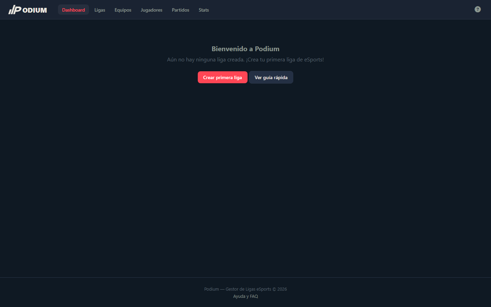
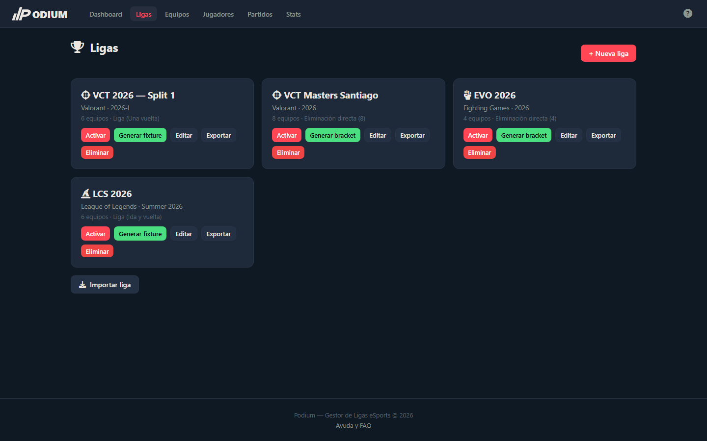
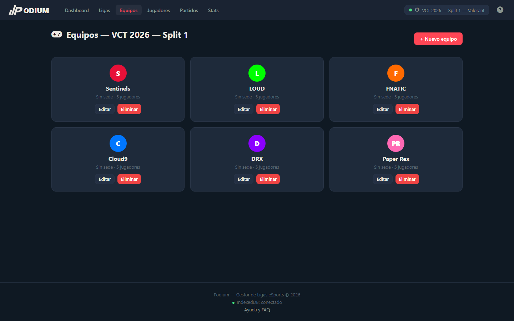
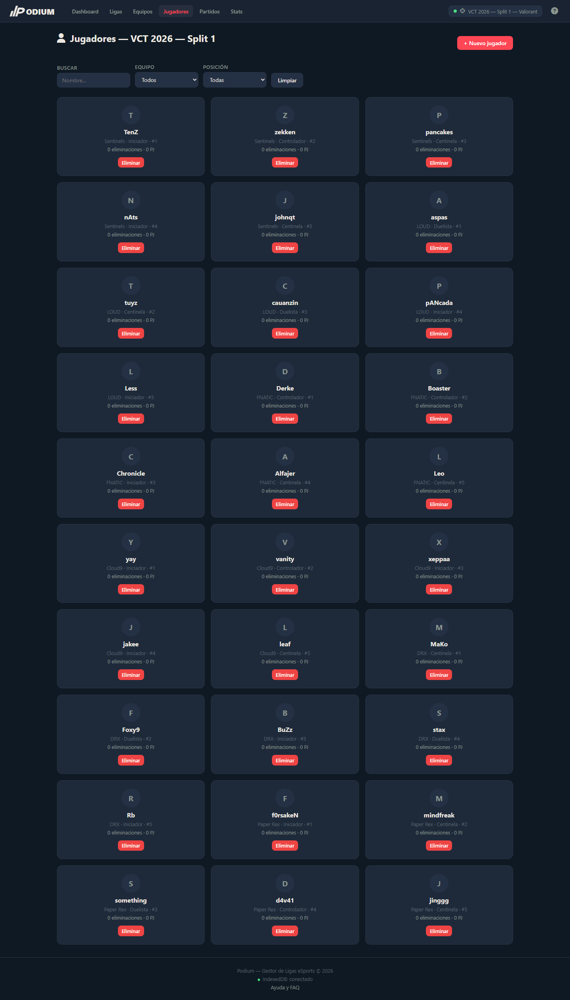
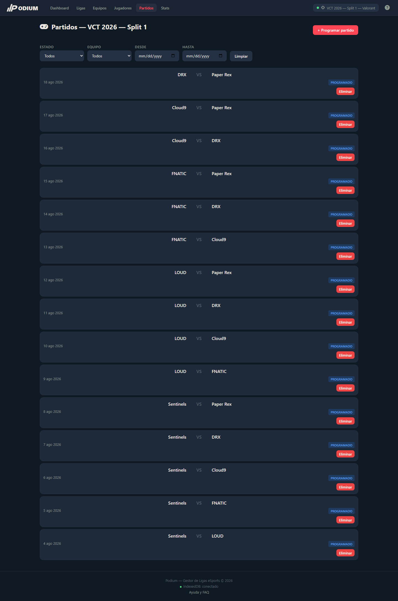
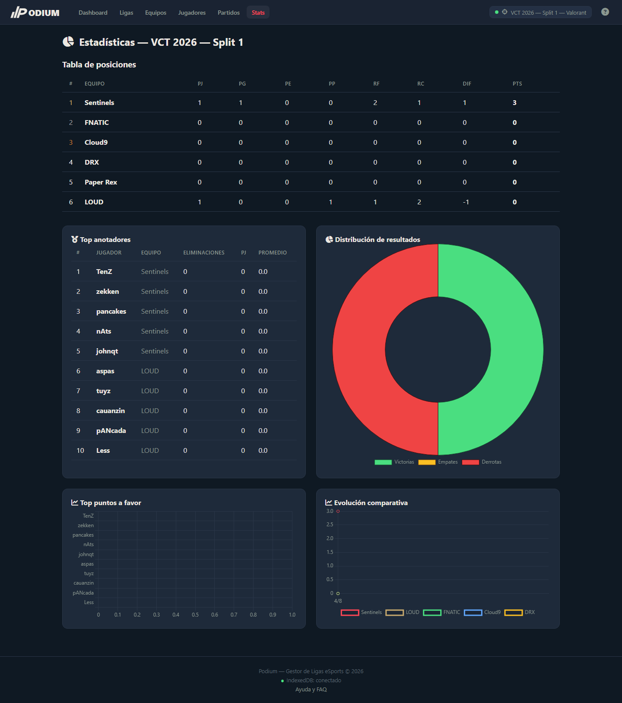
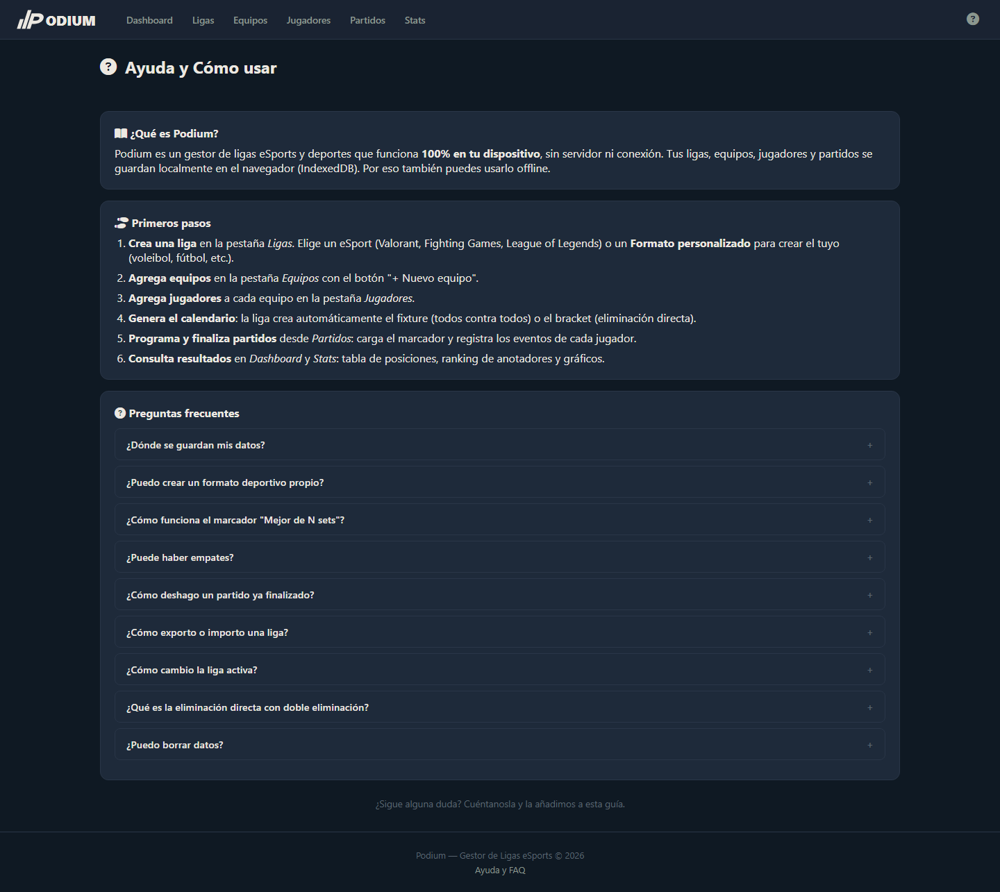
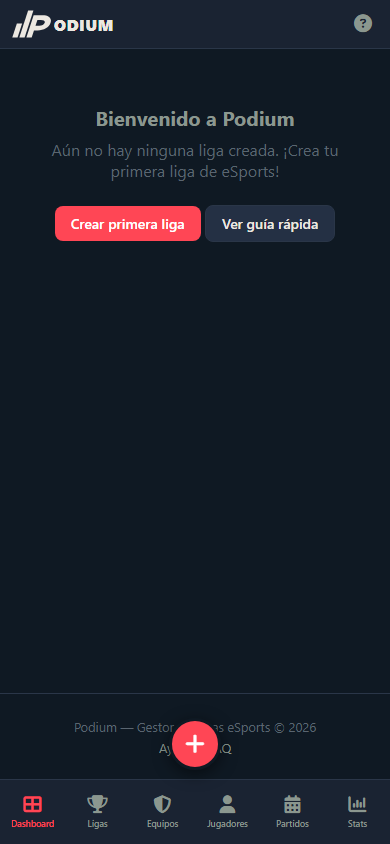

# Podium — Gestor de Ligas eSports

SPA en **JavaScript vanilla** para gestionar ligas y torneos de eSports. Sin backend, sin registro, **100 % offline** con persistencia en IndexedDB.

## Deportes soportados

Cada deporte trae su propia temática visual, terminología y reglas:

| Deporte | Temática | Ícono |
| --- | --- | --- |
| **Valorant** | Roja | `fa-crosshairs` |
| **Fighting Games** | Dorada | `fa-hand-fist` |
| **League of Legends** | Champagne | `fa-crown` |

También puedes crear **formatos personalizados** (voleibol, fútbol, etc.) definiendo tu propia terminología, colores y reglas.

## Funcionalidades

- **CRUD completo**: ligas, equipos, jugadores, partidos y eventos
- **Dos modalidades**:
  - *Liga* — todos contra todos (con fixture generado automáticamente)
  - *Eliminación directa* — bracket simple o doble
- **Tabla de posiciones** con puntuación (3 pts victoria, 1 empate, 0 derrota)
- **Gráficos estadísticos** con Chart.js: distribución de resultados, evolución de puntos y top anotadores
- **Temas visuales dinámicos** según el deporte de la liga activa
- **Registro de eventos** por partido (eliminaciones, KOs, etc., según el deporte)
- **Importar/exportar** ligas en JSON
- **PWA-ready** con manifest, service worker e instalable offline
- **100 % offline** — no requiere servidor ni conexión a internet

## Tecnologías

- **JavaScript vanilla** (ES Modules, Custom Elements)
- **IndexedDB** — persistencia local
- **Chart.js** — gráficos
- **CSS Custom Properties** — temas por deporte
- **Web Components** — componentes reutilizables
- **PWA** — manifest.json + service worker

## Uso

### Opción 1 — Abrir directamente

Abre `index.html` en cualquier navegador moderno (Chrome, Edge, Firefox, Safari).

### Opción 2 — Servidor estático

```
npx serve .
```

### Opción 3 — GitHub Pages

Disponible online en: https://andres-d-garcia.github.io/podium/

> Los datos de ejemplo se cargan automáticamente en el primer arranque. La liga activa se guarda en `localStorage`.

## Estructura del proyecto

```
podium/
├── index.html              # Punto de entrada
├── manifest.json           # Configuración PWA
├── sw.js                   # Service worker (offline)
├── assets/icons/           # Logo SVG del podio
├── css/
│   ├── main.css            # Estilos base y layout
│   ├── components.css      # Estilos de componentes
│   └── themes/             # Temas por deporte (valorant, fighting, lol)
├── js/
│   ├── app.js              # Bootstrap y funciones globales
│   ├── router.js           # Hash router
│   ├── data/               # Deportes y datos de ejemplo
│   ├── db/                 # Capa de datos (IndexedDB)
│   ├── charts/             # Helpers de Chart.js
│   ├── components/         # Custom elements (navbar, cards, modales…)
│   ├── utils/              # Utilidades
│   └── views/              # Vistas: dashboard, ligas, equipos, partidos, stats…
└── screenshots/            # Capturas para este README
```

## Desarrollo

### Requisitos

- Un navegador moderno
- (Opcional) Node.js para servir con `npx serve`

### Comandos

```bash
# Servir en modo desarrollo
npx serve .

# Abrir en el navegador
open http://localhost:3000   # macOS / Linux
start http://localhost:3000  # Windows
```

No hay build step: el proyecto se ejecuta tal cual está en el navegador.

## Capturas de pantalla

### Dashboard


### Ligas


### Equipos


### Jugadores


### Partidos


### Estadísticas


### Ayuda


### Dashboard (móvil)


---

## Licencia

MIT
